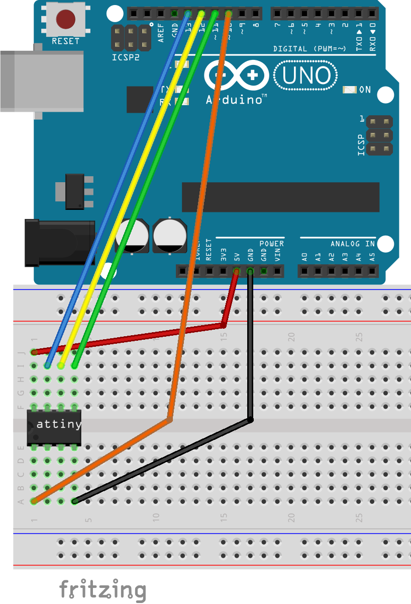
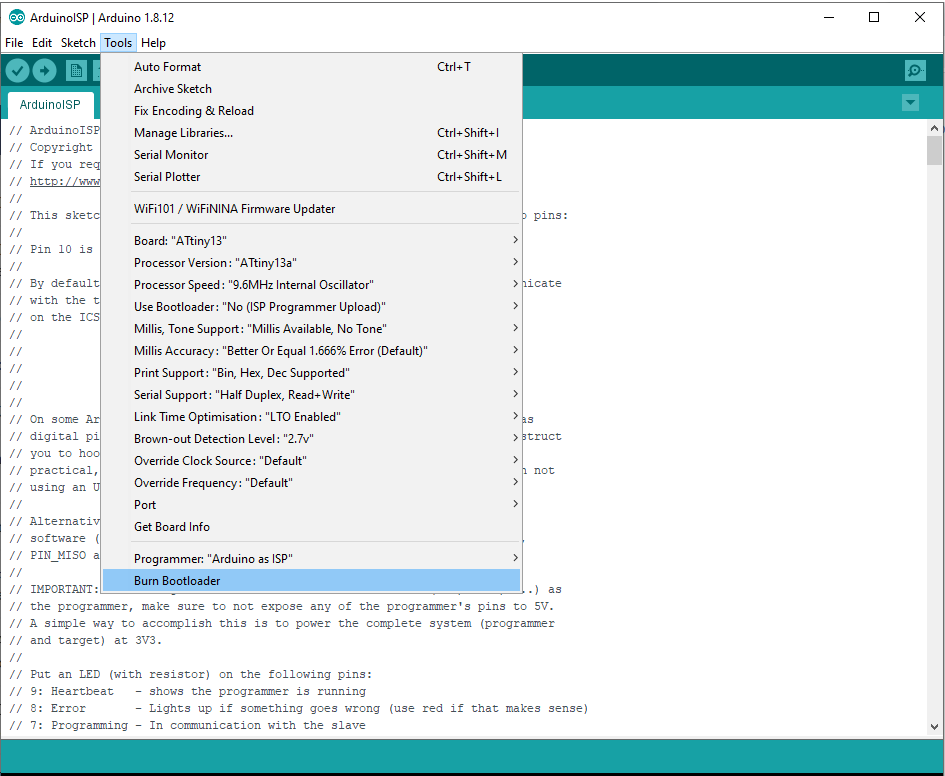

# Low Power Temperature and Humidity Sensor
Has the schematics and code to create a battery power temperature and humidity sensor.
Based on the design from the [Home Circuits Blog](https://homecircuits.eu/blog/battery-powered-esp8266-iot-logger/).

## Setup Arduino Uno
The Arduino IDE can be used to program the ATtiny13.
I followed the instructions on [this instructable](https://www.instructables.com/id/Updated-Guide-on-How-to-Program-an-Attiny13-or-13a/)
as they worked better for me than what was on the blog.

### Connect the Uno and ATtiny
Here is the breadboard layout.

The Pinout follows this table

| Arduino Uno Pin  | ATtiny Pin | Type  |
|------------------|------------| ------|
| 5v               | Pin 8      | Vcc   |
| GND              | Pin 4      | GND   |
| Pin 13           | Pin 7      | SCK   |
| Pin 12           | Pin 6      | MISO  |
| Pin 11           | Pin 5      | MOSI  |
| Pin 10           | Pin 1      | RESET |

This figure shows the pinout of the ATtiny13

### Setting Up the Arduino As ISP (In-System Programmer)
Arduino IDE already contains the program that needs to be loaded to Arduino board, so then it acts the programmer for other boards. 
Navigate to Files-Examples-ArduinoISP and click on ArduinoISP. 
Configure Bard type to Arduino UNO, select the correct Serial Port and Upload the sketch as any other sketch to Arduino board.
At this point Aruduino board is prepared to be programmer for other microcontrolers.

### Downloading the Attiny13(a) Core Files
MicroCore requires Arduino IDE version 1.6.13 or greater.

* Open the Arduino IDE.
* Open the File > Preferences menu item.
* Enter the following URL in Additional Boards Manager URLs: 
https://raw.githubusercontent.com/sleemanj/optiboot/master/dists/package_gogo_diy_attiny_index.json
* Open the Tools > Board > Boards Manager... menu item.
* Wait for the platform indexes to finish downloading.
* Scroll down until you see the DIY ATtiny and click on it.
* Click Install.
* After installation is complete close the Boards Manager window.

### Burning the Bootloader to the Attiny
Next, we want to add the Bootloader to the ATtiny
* Go to Tools-Board and select ATtiny13. 
* After selecting ATtiny13, navigate to Tools-Processor Version and select ATtiny13a. 
* It is not necessary to change any other settings
* Change the programmer to be set as "Arduino as ISP"
* Finally, click the Burn Bootloader button at the bottom of the tools drop-down menu.

This is a figure of the settings

### Programming the Chip
This is the last part for setting up the ATtiny. 
I took the code from the blog and use the Arduino IDE to program the chip.
The code can be found [here](https://gitlab.com/snippets/30510).
A few changes to the code have been made and uploaded to this repository [here](attiny/attiny.ino).

