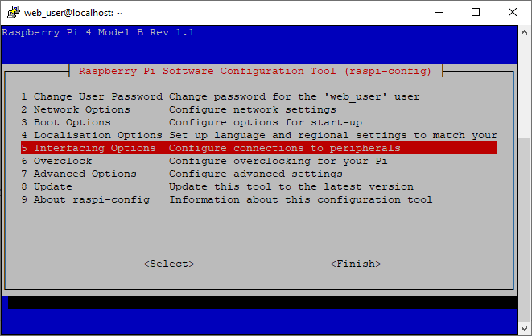
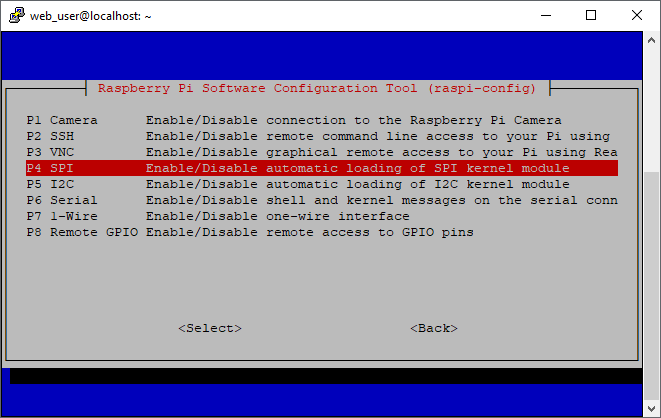
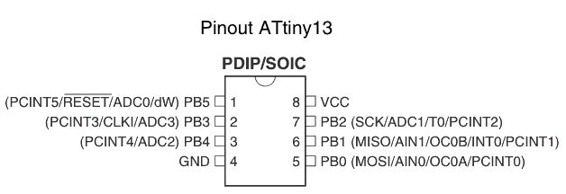

# Low Power Temperature and Humidity Sensor
Has the schematics and code to create a battery power temperature and humidity sensor.
Based on the design from the [Home Circuits Blog](https://homecircuits.eu/blog/battery-powered-esp8266-iot-logger/).

## Setup the Raspberry Pi
Normally the ATtiny13 can be programmed with an Arduino board, 
however this was unavailable to me at the time so I used a Raspberry Pi to program the ATtiny13.
Instructions on how to setup the Raspberry Pi to program the ATtiny13 were taken from 
[Programming the ATtiny85 From Raspberry Pi by prb3333](https://www.instructables.com/id/Programming-the-ATtiny85-from-Raspberry-Pi/).

### Download and build avrdude
From the terminal execute the following commands:

1. sudo apt-get install bison automake autoconf flex git gcc
1. sudo apt-get install gcc-avr binutils-avr avr-libc
1. cd /tmp
1. git clone https://github.com/kcuzner/avrdude
1. cd avrdude/avrdude
1. ./bootstrap && ./configure 
1. sudo make install

### Setup SPI on the GPIO
Use the Raspberry Pi configuration tool to Enable SPI, execute the following command:
 
     sudo raspi-config

On my Raspberry Pi 4 this brings up the following screen

Select the Interfacing Options as highlighted in the image

Enable the SPI interface

### Download and build WiringPi for the gpio commands
Next we want to install WiringPi to setup gpio commands.
This can be done by executing,

    sudo apt-get install wiringpi

The installation can be tested by executing,

    gpio -v

### Electrical Connections 
The next major step is to build the circuit to connect the Pi to the ATtiny13.
I used a GPIO Extension board to set this up.
Below is a screen shot of my setup.

Here is the recommended pinout for programming the ATtiny13 with a Raspberry Pi

| Raspberry Pi Pin | ATtiny Pin | Comment         | Resistor |
|------------------|------------|-----------------|----------|
| 15               | 1          | GPIO22 to Reset | 1 kΩ     |
| 17               | 8          | 3.3 V           | None     |
| 19               | 5          | MOSI            | 1 kΩ     |
| 21               | 6          | MISO            | 1 kΩ     |
| 23               | 7          | SCLK            | 1 kΩ     |
| 25               | 4          | GND             | None     |

This figure shows the pinout of the ATtiny13

This figure shows the pinout of the Raspberry Pi 4

Here is the schematic for how to connect the ATtiny85 and the Raspberry Pi

### Test Avrdude Connection
Test avrdude connection to the ATtiny13, we are set up with GPIO pin 22 on the ATtiny reset. 
We must pull this pin low to program the chip. 

Execute the following commands:

    sudo gpio -g mode 22 out
    sudo gpio -g write 22 0
    sudo avrdude -p t13 -P /dev/spidev0.0 -c linuxspi -b 10000
    
